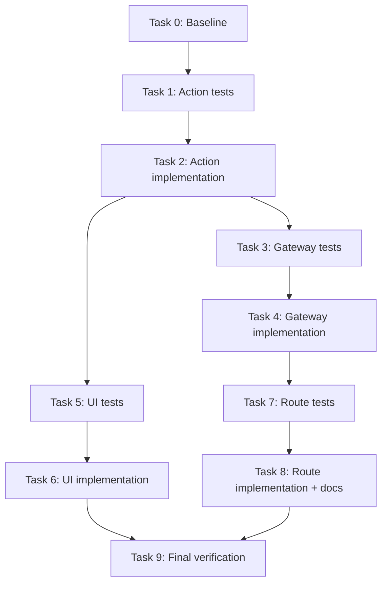

# Tool-First Integrations and Button Clarity Implementation Plan

**Goal:** Turn the current integrations area into a tool-first flow with clearer CTAs, a shared action model, and thin gateway-backed connect/revoke routes.

**Architecture:** Keep the Next.js App Router and Prisma-backed route handlers, but move integration decision-making into `src/modules/integrations/**` and reuse one button/action model across the hub, provider cards, wizard shells, and provider setup pages.

**Tech Stack:** Next.js 16, React 19, TypeScript, Prisma 7, Zod, Vitest, Testing Library, Playwright.

**Estimated Complexity:** 10 tasks: 1 XS, 4 S, 5 M = ~14 effort units.

**Critical Path:** Tasks 1 -> 2 -> 3 -> 4 -> 7 -> 8 -> 9.

**Risk Assessment:**
- Highest risk task: Task 4, because the gateway refactor touches the existing connect/revoke persistence and audit path.
- Mitigation: keep the gateway API thin, pure where possible, and preserve the current response shape while moving logic out of the route handlers.

**Milestones:**
1. Core action model locked - Tasks 0-2
2. Gateway and UI contract locked - Tasks 3-6
3. Route wrappers and docs locked - Tasks 7-8
4. Final regression pass - Task 9

---

## Requirements snapshot

- Keep the current integrations page additive; do not rename or move existing routes.
- Replace vague CTA copy with explicit labels like `Open setup wizard`, `Open official login`, and `Open official docs`.
- Keep connect/revoke secrets server-side and keep audit events intact.
- Use one shared action model so `ProviderCard`, `ProviderWizardShell`, and the setup pages do not drift.
- Make the route handlers thin wrappers around a reusable gateway module.

## Dependency DAG



## Parallel work

### Parallel group A
- Task 3: Gateway tests [depends on Task 2]
- Task 5: UI tests [depends on Task 2]

### Parallel group B
- Task 4: Gateway implementation [depends on Task 3]
- Task 6: UI implementation [depends on Task 5]

### Parallel group C
- Task 7: Route tests [depends on Task 4]
- Task 8: Route implementation + docs [depends on Task 7]

## Rollback points

- After Task 2: revert the new action model if the CTA hierarchy needs redesign.
- After Task 6: revert the UI shell/button changes if the copy or layout causes friction.
- After Task 8: revert the route wrapper refactor if route contracts need to stay inline.

## Task 0: Baseline verification [Size: XS] [Depends: none]

**Step 1: Verify the local toolchain**
- Command: `node --version && npm --version`
- Expected output: Node 22.x and a recent npm version.

**Step 2: Capture the current baseline**
- Command: `npm test && npm run build`
- Expected output: The existing test suite and production build both pass before changes start.

## Task 1: Write failing tests for the shared integration action model [Size: S] [Depends: Task 0]

**Step 1: Write the failing test**
- File: `src/modules/integrations/integration-actions.test.ts`
- Code:
  ```ts
  import { describe, expect, it } from "vitest";
  import { providerRegistry } from "./provider-registry";
  import { buildProviderActionDeck } from "./integration-actions";

  describe("buildProviderActionDeck", () => {
    it("prefers the setup wizard for providers that have an internal flow", () => {
      const deck = buildProviderActionDeck(providerRegistry.openai);

      expect(deck.primary).toEqual({
        kind: "primary",
        label: "Open setup wizard",
        href: "/settings/integrations/openai",
      });
      expect(deck.secondary).toEqual({
        kind: "secondary",
        label: "Open official login",
        href: providerRegistry.openai.officialLoginUrl,
      });
      expect(deck.tertiary).toEqual({
        kind: "tertiary",
        label: "Open official docs",
        href: providerRegistry.openai.officialDocsUrl,
      });
    });

    it("uses official docs as the primary action for guidance-only providers", () => {
      const deck = buildProviderActionDeck(providerRegistry.plaid);

      expect(deck.primary).toEqual({
        kind: "primary",
        label: "Open official docs",
        href: providerRegistry.plaid.officialDocsUrl,
      });
      expect(deck.secondary).toEqual({
        kind: "secondary",
        label: "Open official login",
        href: providerRegistry.plaid.officialLoginUrl,
      });
      expect(deck.tertiary).toBeUndefined();
    });
  });
  ```

**Step 2: Run the test and verify the failure**
- Command: `npm test -- src/modules/integrations/integration-actions.test.ts`
- Expected output: Vitest fails because `buildProviderActionDeck` does not exist yet.

## Task 2: Implement the shared integration action model [Size: S] [Depends: Task 1]

**Step 1: Implement the action deck helper**
- File: `src/modules/integrations/integration-actions.ts`
- Code:
  ```ts
  import type { ProviderDefinition } from "./provider-types";

  export type ProviderAction = {
    kind: "primary" | "secondary" | "tertiary";
    label: string;
    href: string;
  };

  export type ProviderActionDeck = {
    primary: ProviderAction;
    secondary: ProviderAction;
    tertiary?: ProviderAction;
  };

  export function buildProviderActionDeck(
    provider: ProviderDefinition,
  ): ProviderActionDeck {
    if (provider.setupPath) {
      return {
        primary: { kind: "primary", label: "Open setup wizard", href: provider.setupPath },
        secondary: {
          kind: "secondary",
          label: "Open official login",
          href: provider.officialLoginUrl,
        },
        tertiary: {
          kind: "tertiary",
          label: "Open official docs",
          href: provider.officialDocsUrl,
        },
      };
    }

    return {
      primary: {
        kind: "primary",
        label: "Open official docs",
        href: provider.officialDocsUrl,
      },
      secondary: {
        kind: "secondary",
        label: "Open official login",
        href: provider.officialLoginUrl,
      },
    };
  }
  ```

**Step 2: Run the test and verify it passes**
- Command: `npm test -- src/modules/integrations/integration-actions.test.ts`
- Expected output: `PASS src/modules/integrations/integration-actions.test.ts`

## Task 3: Write failing tests for the integration gateway [Size: M] [Depends: Task 2]

**Step 1: Write the failing tests**
- File: `src/modules/integrations/integration-gateway.test.ts`
- Code:
  ```ts
  import { beforeEach, describe, expect, it, vi } from "vitest";
  import { connectIntegration, revokeIntegration } from "./integration-gateway";

  const prismaMock = {
    integrationConnection: { upsert: vi.fn() },
    auditEvent: { create: vi.fn() },
  };

  vi.mock("@/lib/prisma", () => ({
    getPrismaClient: () => prismaMock,
  }));

  describe("integration gateway", () => {
    beforeEach(() => {
      vi.clearAllMocks();
    });

    it("connectIntegration seals the secret, stores the provider label, and logs the audit event", async () => {
      const result = await connectIntegration(
        {
          workspaceId: "workspace-1",
          actorUserId: "user-1",
          connectionId: "conn-1",
          provider: "openai",
          secret: "sk_test_secret_value",
        },
        { encryptionKey: "budgetbitch-provider-secret-key-32" },
      );

      expect(prismaMock.integrationConnection.upsert).toHaveBeenCalledTimes(1);
      expect(prismaMock.auditEvent.create).toHaveBeenCalledTimes(1);
      expect(result.status).toBe("connected");
      expect(result.secretFingerprint).toMatch(/^[a-f0-9]{12}$/);
    });

    it("revokeIntegration marks the connection revoked and preserves the fingerprint", async () => {
      const result = await revokeIntegration({
        workspaceId: "workspace-1",
        actorUserId: "user-1",
        connectionId: "conn-1",
        provider: "openai",
        encryptedSecret: "sealed-value",
        secretFingerprint: "abc123def456",
      });

      expect(prismaMock.integrationConnection.upsert).toHaveBeenCalledTimes(1);
      expect(prismaMock.auditEvent.create).toHaveBeenCalledTimes(1);
      expect(result.status).toBe("revoked");
      expect(result.secretFingerprint).toBe("abc123def456");
    });
  });
  ```

**Step 2: Run the test and verify the failure**
- Command: `npm test -- src/modules/integrations/integration-gateway.test.ts`
- Expected output: Vitest fails because the gateway module does not exist yet.

## Task 4: Implement the integration gateway [Size: M] [Depends: Task 3]

**Step 1: Implement the gateway**
- File: `src/modules/integrations/integration-gateway.ts`
- Code:
  ```ts
  import type { Prisma } from "@prisma/client";
  import { getPrismaClient } from "@/lib/prisma";
  import {
    buildIntegrationConnectedAuditEvent,
    buildIntegrationRevokedAuditEvent,
  } from "@/modules/audit/integration-audit";
  import {
    createConnectionVaultEntry,
    revokeConnectionVaultEntry,
  } from "@/modules/integrations/connection-vault";
  import { providerRegistry } from "./provider-registry";

  export type IntegrationGatewayEnv = {
    encryptionKey?: string;
  };

  export type ConnectIntegrationInput = {
    workspaceId: string;
    actorUserId: string;
    connectionId: string;
    provider: keyof typeof providerRegistry;
    secret: string;
  };

  export type RevokeIntegrationInput = {
    workspaceId: string;
    actorUserId: string;
    connectionId: string;
    provider: keyof typeof providerRegistry;
    encryptedSecret: string;
    secretFingerprint: string;
  };

  export async function connectIntegration(
    input: ConnectIntegrationInput,
    env: IntegrationGatewayEnv,
  ) {
    if (!env.encryptionKey) {
      throw new Error("PROVIDER_SECRET_ENCRYPTION_KEY is not configured on the server.");
    }

    const vaultEntry = createConnectionVaultEntry({
      provider: input.provider,
      secret: input.secret,
      encryptionKey: env.encryptionKey,
    });
    const auditEvent = buildIntegrationConnectedAuditEvent({
      workspaceId: input.workspaceId,
      actorUserId: input.actorUserId,
      provider: input.provider,
      targetId: input.connectionId,
    });
    const prisma = getPrismaClient();
    const providerDefinition = providerRegistry[input.provider];

    await prisma.integrationConnection.upsert({
      where: { id: input.connectionId },
      update: {
        workspaceId: input.workspaceId,
        provider: input.provider,
        displayName: providerDefinition.label,
        authType: "api_key",
        encryptedSecret: vaultEntry.encryptedSecret,
        secretFingerprint: vaultEntry.secretFingerprint,
        status: vaultEntry.status,
        revokedAt: null,
      },
      create: {
        id: input.connectionId,
        workspaceId: input.workspaceId,
        provider: input.provider,
        displayName: providerDefinition.label,
        authType: "api_key",
        encryptedSecret: vaultEntry.encryptedSecret,
        secretFingerprint: vaultEntry.secretFingerprint,
        status: vaultEntry.status,
      },
    });

    await prisma.auditEvent.create({
      data: {
        ...auditEvent,
        metadataJson: auditEvent.metadataJson as Prisma.InputJsonValue,
      },
    });

    return {
      connectionId: input.connectionId,
      provider: input.provider,
      secretFingerprint: vaultEntry.secretFingerprint,
      status: vaultEntry.status,
      auditEvent,
    };
  }

  export async function revokeIntegration(input: RevokeIntegrationInput) {
    const vaultEntry = revokeConnectionVaultEntry({
      provider: input.provider,
      encryptedSecret: input.encryptedSecret,
      secretFingerprint: input.secretFingerprint,
      status: "connected",
    });
    const auditEvent = buildIntegrationRevokedAuditEvent({
      workspaceId: input.workspaceId,
      actorUserId: input.actorUserId,
      provider: input.provider,
      targetId: input.connectionId,
    });
    const prisma = getPrismaClient();
    const providerDefinition = providerRegistry[input.provider];

    await prisma.integrationConnection.upsert({
      where: { id: input.connectionId },
      update: {
        workspaceId: input.workspaceId,
        provider: input.provider,
        displayName: providerDefinition.label,
        authType: "api_key",
        encryptedSecret: input.encryptedSecret,
        secretFingerprint: vaultEntry.secretFingerprint,
        status: vaultEntry.status,
        revokedAt: vaultEntry.revokedAt,
      },
      create: {
        id: input.connectionId,
        workspaceId: input.workspaceId,
        provider: input.provider,
        displayName: providerDefinition.label,
        authType: "api_key",
        encryptedSecret: input.encryptedSecret,
        secretFingerprint: vaultEntry.secretFingerprint,
        status: vaultEntry.status,
        revokedAt: vaultEntry.revokedAt,
      },
    });

    await prisma.auditEvent.create({
      data: {
        ...auditEvent,
        metadataJson: auditEvent.metadataJson as Prisma.InputJsonValue,
      },
    });

    return {
      connectionId: input.connectionId,
      provider: input.provider,
      secretFingerprint: vaultEntry.secretFingerprint,
      status: vaultEntry.status,
      revokedAt: vaultEntry.revokedAt,
      auditEvent,
    };
  }
  ```

**Step 2: Run the test and verify it passes**
- Command: `npm test -- src/modules/integrations/integration-gateway.test.ts`
- Expected output: `PASS src/modules/integrations/integration-gateway.test.ts`

## Task 5: Write failing UI tests for the shared tool rail and explicit button labels [Size: M] [Depends: Task 2]

**Step 1: Write the failing tests**
- File: `src/components/integrations/tool-rail.test.tsx`
- File: `src/components/integrations/provider-card.test.tsx`
- File: `src/components/integrations/provider-wizard-shell.test.tsx`
- File: `src/app/(app)/settings/integrations/page.test.tsx`
- File: `src/app/(app)/settings/integrations/openai/page.test.tsx`
- File: `tests/e2e/integrations-tool-rail.spec.ts`
- Code for the new component test:
  ```tsx
  import { render, screen } from "@testing-library/react";
  import { describe, expect, it } from "vitest";
  import { ToolRail } from "./tool-rail";

  describe("ToolRail", () => {
    it("renders the primary and secondary actions with explicit labels", () => {
      render(
        <ToolRail
          title="Tools"
          actions={[
            { kind: "primary", label: "Open setup wizard", href: "/settings/integrations/openai" },
            { kind: "secondary", label: "Open official login", href: "https://platform.openai.com/login" },
            { kind: "tertiary", label: "Open official docs", href: "https://platform.openai.com/docs" },
          ]}
        />,
      );

      expect(screen.getByRole("heading", { name: "Tools" })).toBeInTheDocument();
      expect(screen.getByRole("link", { name: "Open setup wizard" })).toHaveAttribute(
        "href",
        "/settings/integrations/openai",
      );
      expect(screen.getByRole("link", { name: "Open official login" })).toHaveAttribute(
        "href",
        "https://platform.openai.com/login",
      );
      expect(screen.getByRole("link", { name: "Open official docs" })).toHaveAttribute(
        "href",
        "https://platform.openai.com/docs",
      );
    });
  });
  ```
- Code for the Playwright smoke test:
  ```ts
  import { expect, test } from "@playwright/test";

  test("OpenAI setup page shows explicit tool rail labels", async ({ page }) => {
    await page.goto("/settings/integrations/openai");

    await expect(page.getByRole("link", { name: "Open setup wizard" })).toBeVisible();
    await expect(page.getByRole("link", { name: "Open official login" })).toBeVisible();
    await expect(page.getByRole("link", { name: "Open official docs" })).toBeVisible();
  });
  ```

**Step 2: Run the tests and verify the failure**
- Command: `npm test -- src/components/integrations/tool-rail.test.tsx src/components/integrations/provider-card.test.tsx src/components/integrations/provider-wizard-shell.test.tsx src/app/(app)/settings/integrations/page.test.tsx src/app/(app)/settings/integrations/openai/page.test.tsx && npm run test:e2e -- tests/e2e/integrations-tool-rail.spec.ts`
- Expected output: Vitest and Playwright fail because the tool rail and explicit labels do not exist yet.

## Task 6: Implement the shared UI shell and explicit button copy [Size: M] [Depends: Task 5]

**Step 1: Implement the tool rail and update the shared integration UI**
- Files:
  - `src/components/integrations/tool-rail.tsx`
  - `src/components/integrations/provider-card.tsx`
  - `src/components/integrations/provider-wizard-shell.tsx`
  - `src/app/(app)/settings/integrations/page.tsx`
  - `src/app/(app)/settings/integrations/claude/page.tsx`
  - `src/app/(app)/settings/integrations/openai/page.tsx`
  - `src/app/(app)/settings/integrations/copilot/page.tsx`
  - `src/app/(app)/settings/integrations/openclaw/page.tsx`
- Implementation notes:
  - `ToolRail` should render the action deck as a grouped set of links.
  - `ProviderWizardShell` should accept `actions` and render the new rail above the disclosure content.
  - `ProviderCard` should use `buildProviderActionDeck(provider)` so hub buttons match the setup pages.
  - Use the explicit labels from Task 1; do not keep the old generic copy.

**Step 2: Run the tests and verify they pass**
- Command: `npm test -- src/components/integrations/tool-rail.test.tsx src/components/integrations/provider-card.test.tsx src/components/integrations/provider-wizard-shell.test.tsx src/app/(app)/settings/integrations/page.test.tsx src/app/(app)/settings/integrations/openai/page.test.tsx`
- Expected output: all targeted UI tests pass.

## Task 7: Write failing tests for the thin route wrappers [Size: S] [Depends: Task 4]

**Step 1: Write the failing tests**
- File: `src/app/api/v1/integrations/connect/route.test.ts`
- File: `src/app/api/v1/integrations/revoke/route.test.ts`
- Code:
  ```ts
  import { describe, expect, it, vi } from "vitest";
  import { POST as connectPOST } from "./connect/route";
  import { POST as revokePOST } from "./revoke/route";

  vi.mock("@/modules/integrations/integration-gateway", () => ({
    connectIntegration: vi.fn().mockResolvedValue({
      connectionId: "conn-1",
      provider: "openai",
      secretFingerprint: "abc123def456",
      status: "connected",
      auditEvent: { action: "integration_connected" },
    }),
    revokeIntegration: vi.fn().mockResolvedValue({
      connectionId: "conn-1",
      provider: "openai",
      secretFingerprint: "abc123def456",
      status: "revoked",
      revokedAt: new Date("2026-04-09T00:00:00.000Z"),
      auditEvent: { action: "integration_revoked" },
    }),
  }));

  describe("integration route wrappers", () => {
    it("connect POST delegates to the gateway and returns the gateway payload", async () => {
      const response = await connectPOST(
        new Request("http://localhost/api/v1/integrations/connect", {
          method: "POST",
          body: JSON.stringify({
            workspaceId: "workspace-1",
            actorUserId: "user-1",
            connectionId: "conn-1",
            provider: "openai",
            secret: "sk_test_secret_value",
          }),
        }),
      );

      expect(response.status).toBe(200);
      expect((await response.json()).status).toBe("connected");
    });

    it("revoke POST delegates to the gateway and returns the revoked payload", async () => {
      const response = await revokePOST(
        new Request("http://localhost/api/v1/integrations/revoke", {
          method: "POST",
          body: JSON.stringify({
            workspaceId: "workspace-1",
            actorUserId: "user-1",
            connectionId: "conn-1",
            provider: "openai",
            encryptedSecret: "sealed-value",
            secretFingerprint: "abc123def456",
          }),
        }),
      );

      expect(response.status).toBe(200);
      expect((await response.json()).status).toBe("revoked");
    });
  });
  ```

**Step 2: Run the tests and verify the failure**
- Command: `npm test -- src/app/api/v1/integrations/connect/route.test.ts src/app/api/v1/integrations/revoke/route.test.ts`
- Expected output: the route tests fail because the handlers still own the persistence logic.

## Task 8: Refactor the routes to call the gateway and update docs [Size: M] [Depends: Task 7]

**Step 1: Refactor the route handlers**
- Files:
  - `src/app/api/v1/integrations/connect/route.ts`
  - `src/app/api/v1/integrations/revoke/route.ts`
  - `docs/CODEBASE_INDEX.md`
- Implementation notes:
  - Keep the current Zod schemas and AI provider enum.
  - Move the vault, audit, and Prisma work behind `connectIntegration` and `revokeIntegration`.
  - Keep the response shape unchanged so existing callers do not break.
  - Update `docs/CODEBASE_INDEX.md` to mention the new `integration-actions.ts`, `integration-gateway.ts`, and `tool-rail.tsx` surfaces.

**Step 2: Run the tests and verify they pass**
- Command: `npm test -- src/app/api/v1/integrations/connect/route.test.ts src/app/api/v1/integrations/revoke/route.test.ts`
- Expected output: both route wrapper tests pass.

## Task 9: Final verification [Size: S] [Depends: Task 6, Task 8]

**Step 1: Run the full checks**
- Command: `npm run lint && npm test && npm run build && npm run test:e2e`
- Expected output: lint, unit tests, production build, and Playwright all pass.

**Step 2: Confirm the shipped surfaces**
- The integrations hub shows explicit action labels.
- The provider wizard shell shows the shared tool rail.
- Connect/revoke still go through the server-side gateway and keep audit history intact.
- The docs map reflects the new integration surfaces.
