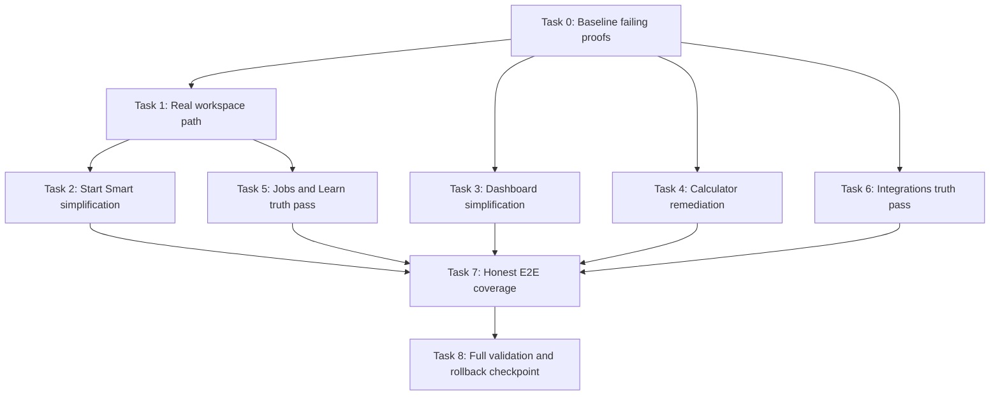

# BudgetBITCH Product Truth and Low-Stimulation Implementation Plan

**Goal:** restore product trust by making the primary app flows work against real workspace state, simplifying the scan experience to title plus short summary, and removing demo-only behavior from user-critical surfaces.

**Architecture:** keep the current Next.js App Router, Prisma, Auth.js, and existing route ownership. Fix the root functional gap first by removing demo-workspace coupling from Start Smart and downstream recommendation surfaces, then simplify UI density within each owning component. Preserve detail pages, setup pages, and server authorization boundaries.

**Tech Stack:** Next.js App Router, React 19, TypeScript, Prisma 7, Zod, next-intl, Vitest, Testing Library, Playwright.

**Estimated Complexity:** 8 tasks total. 2 XS, 3 S, 3 M.

**Critical Path:** Task 0 -> Task 1 -> Task 2 -> Task 7.

**Risk Assessment:**
- Highest risk task: Task 1, because Start Smart currently mixes demo assumptions with real workspace authorization.
- Mitigation: make the first failing proof a real workspace-path test, then wire page-to-shell workspace ownership before touching UI polish.

**Milestones:**
1. Functional truth restored on Start Smart and recommendation consumers.
2. Low-stimulation UI pass on Start Smart, Dashboard, and Calculator.
3. Truthful jobs and integrations surfaces with updated tests.
4. Full repo verification.

---

## Design Basis

This plan assumes the approved design is:

1. Primary surfaces must be low-stimulation and scan-first: one direct title, one short summary, short facts only, no overloaded cards.
2. Start Smart must work against a real active workspace rather than a demo workspace.
3. The dashboard must stay usable without late remounts or heavy copy.
4. The calculator must answer a budgeting question, not just expose a keypad.
5. Jobs and integrations must stop implying live functionality they do not currently provide.
6. Tests must prove real product behavior for critical flows instead of only mocked happy paths.

## Dependency DAG



Parallel work after Task 1:
Task 3, Task 4, and Task 6 can run independently.
Task 5 can start once Task 1 lands because it depends on the same workspace-truth plumbing.

## Task 0: Establish failing proofs for the real problem

**Size:** S
**Depends on:** none

**Files:**
- [tests/e2e/start-smart.spec.ts](tests/e2e/start-smart.spec.ts)
- [tests/e2e/dashboard.spec.ts](tests/e2e/dashboard.spec.ts)
- [tests/e2e/jobs.spec.ts](tests/e2e/jobs.spec.ts)
- [tests/e2e/integrations-tool-rail.spec.ts](tests/e2e/integrations-tool-rail.spec.ts)

### Step 1: remove false-green assumptions from the critical tests.

- Stop relying on route stubs for the Start Smart blueprint flow in the main production-path spec.
- Keep route stubs only in explicitly labeled UI-isolation specs if still needed.

### Step 2: add failing assertions that match the approved design.

- Start Smart: primary panel must work without forced clicks and must surface a short error if blueprint generation fails.
- Dashboard: only one support sentence per panel header and no dense stacked descriptive copy.
- Jobs: surface must explicitly indicate whether data is live or sample.
- Integrations: surface must explicitly indicate whether a provider is configured, setup-only, or connected.

### Step 3: run the failing checks.

```bash
npm run test:e2e -- tests/e2e/start-smart.spec.ts tests/e2e/dashboard.spec.ts tests/e2e/jobs.spec.ts tests/e2e/integrations-tool-rail.spec.ts
```

Expected result:
- FAIL, for the right reasons.
- At least one failure must prove the real Start Smart path is broken.
- Existing mocked copy-only expectations should be replaced by truthful product expectations.

Rollback point:
None yet. This is the baseline proof phase.

## Task 1: Remove demo-workspace coupling from Start Smart and shared recommendation readers

**Size:** M
**Depends on:** Task 0

**Files:**
- [src/app/(app)/start-smart/page.tsx](src/app/(app)/start-smart/page.tsx)
- [src/components/start-smart/start-smart-shell.tsx](src/components/start-smart/start-smart-shell.tsx)
- [src/app/api/v1/start-smart/blueprint/route.ts](src/app/api/v1/start-smart/blueprint/route.ts)
- [src/lib/auth/workspace-api-access.ts](src/lib/auth/workspace-api-access.ts)
- [src/modules/workspaces/active-workspace.ts](src/modules/workspaces/active-workspace.ts)
- [src/app/api/v1/start-smart/blueprint/route.test.ts](src/app/api/v1/start-smart/blueprint/route.test.ts)
- Add a page-level test for Start Smart if missing near the route surface.

### Step 1: write failing tests for real workspace ownership.

- The page must pass a trusted active workspace id into the shell.
- The shell must submit that workspace id instead of the hard-coded value currently used in [src/components/start-smart/start-smart-shell.tsx](src/components/start-smart/start-smart-shell.tsx#L296).
- The route test must continue to reject unauthenticated or non-member access, but no longer depend on the client hard-coding demo mode.

```bash
npm test -- src/app/api/v1/start-smart/blueprint/route.test.ts src/components/start-smart/start-smart-shell.test.tsx
```

Expected result:
- FAIL because Start Smart currently posts the demo workspace id.

### Step 2: implement the minimal real-workspace path.

- Make [src/app/(app)/start-smart/page.tsx](src/app/(app)/start-smart/page.tsx) own active workspace resolution.
- Pass the resolved workspace id into the shell as a prop.
- Make the shell refuse submit with a short, direct message if no workspace is available.
- Preserve server authorization in the route; do not weaken [src/lib/auth/workspace-api-access.ts](src/lib/auth/workspace-api-access.ts).

### Step 3: rerun the focused tests.

```bash
npm test -- src/app/api/v1/start-smart/blueprint/route.test.ts src/components/start-smart/start-smart-shell.test.tsx
```

Expected result:
- PASS.
- The request body uses a trusted workspace id from the page context, not demo_workspace.

Rollback point:
After this task, Start Smart workspace ownership is truthful and test-backed.

## Task 2: Convert Start Smart to the approved fixed, low-stimulation flow

**Size:** M
**Depends on:** Task 1

**Files:**
- [src/components/start-smart/start-smart-shell.tsx](src/components/start-smart/start-smart-shell.tsx)
- [src/components/start-smart/profile-form.tsx](src/components/start-smart/profile-form.tsx)
- [src/components/start-smart/blueprint-panel.tsx](src/components/start-smart/blueprint-panel.tsx)
- [src/components/start-smart/start-smart-shell.test.tsx](src/components/start-smart/start-smart-shell.test.tsx)
- [src/components/start-smart/blueprint-panel.test.tsx](src/components/start-smart/blueprint-panel.test.tsx)
- [tests/e2e/start-smart.spec.ts](tests/e2e/start-smart.spec.ts)

### Step 1: write failing tests for the new compact display contract.

- One title and one short summary only.
- Summary cards reduced to essential state only.
- Primary action always visible without forced click.
- Blueprint panel surfaces short section titles and short summaries, not paragraph blocks.

```bash
npm test -- src/components/start-smart/start-smart-shell.test.tsx src/components/start-smart/blueprint-panel.test.tsx
```

Expected result:
- FAIL on current verbose layout and dense copy.

### Step 2: implement the simplified shell.

- Reduce header copy to title plus short summary.
- Remove duplicated explanatory copy across panel header, sidebar, and footer.
- Keep the four-step structure from the approved fixed-screen design.
- Replace ambiguous labels with direct step titles.
- Ensure action bar buttons remain visible at mobile height without `force: true` in Playwright.

### Step 3: run focused UI and E2E validation.

```bash
npm test -- src/components/start-smart/start-smart-shell.test.tsx src/components/start-smart/blueprint-panel.test.tsx
npm run test:e2e -- tests/e2e/start-smart.spec.ts
```

Expected result:
- PASS.
- No forced interactions remain in the main Start Smart flow.

Rollback point:
If the layout regresses, revert only the shell simplification while keeping Task 1’s workspace fix.

## Task 3: Simplify Dashboard to title plus short summary and stable actions

**Size:** S
**Depends on:** Task 0

**Files:**
- [src/components/dashboard/money-dashboard.tsx](src/components/dashboard/money-dashboard.tsx)
- [src/app/(app)/dashboard/page.tsx](src/app/(app)/dashboard/page.tsx)
- [src/components/dashboard/money-dashboard.test.tsx](src/components/dashboard/money-dashboard.test.tsx)
- [src/app/(app)/dashboard/page.test.tsx](src/app/(app)/dashboard/page.test.tsx)
- [tests/e2e/dashboard.spec.ts](tests/e2e/dashboard.spec.ts)

### Step 1: write failing tests for scan-first dashboard display.

- Each panel header exposes only a title and one short summary.
- Success feedback remains visible after Local and Privacy saves.
- Record refresh remains cancelable once the user leaves the Record tab.

```bash
npm test -- src/components/dashboard/money-dashboard.test.tsx src/app/(app)/dashboard/page.test.tsx
```

Expected result:
- FAIL where copy and density still exceed the design.

### Step 2: implement the copy and layout pass.

- Keep panel titles direct.
- Reduce helper text to one sentence.
- Collapse metadata into short facts instead of prose blocks.
- Preserve current action labels and functional saves.

### Step 3: verify the dashboard slice.

```bash
npm test -- src/components/dashboard/money-dashboard.test.tsx src/app/(app)/dashboard/page.test.tsx
npm run test:e2e -- tests/e2e/dashboard.spec.ts
```

Expected result:
- PASS.
- Dashboard actions still work and the interface is materially less dense.

## Task 4: Replace the arithmetic-first calculator with a budgeting-first calculator

**Size:** M
**Depends on:** Task 0

**Files:**
- [src/components/calculator/calculator.tsx](src/components/calculator/calculator.tsx)
- [src/app/(app)/calculator/page.tsx](src/app/(app)/calculator/page.tsx)
- [src/components/calculator/calculator.test.tsx](src/components/calculator/calculator.test.tsx)
- [src/app/(app)/calculator/page.test.tsx](src/app/(app)/calculator/page.test.tsx)

### Step 1: write failing tests for the new budgeting behavior.

- Primary inputs: income and fixed bills.
- Primary result: safe left or left to spend.
- Secondary arithmetic keypad may remain, but not as the top-level answer.

```bash
npm test -- src/components/calculator/calculator.test.tsx src/app/(app)/calculator/page.test.tsx
```

Expected result:
- FAIL because the current component is a four-function keypad in [src/components/calculator/calculator.tsx](src/components/calculator/calculator.tsx#L7).

### Step 2: implement the budgeting-first calculator.

- Add income, fixed bills, and optional flexible spend fields.
- Compute safe-left summary.
- Keep a minimal arithmetic utility behind a secondary toggle only if needed.
- Reduce the page intro to title plus one short summary.

### Step 3: rerun focused tests.

```bash
npm test -- src/components/calculator/calculator.test.tsx src/app/(app)/calculator/page.test.tsx
```

Expected result:
- PASS.
- Calculator now answers a budgeting question instead of exposing only arithmetic.

Rollback point:
This task is self-contained and can be reverted without affecting workspace or auth logic.

## Task 5: Make Jobs and Learn truthful about data source and stop depending on demo workspace

**Size:** M
**Depends on:** Task 1

**Files:**
- [src/modules/jobs/recommended-jobs.ts](src/modules/jobs/recommended-jobs.ts)
- [src/modules/jobs/job-catalog.ts](src/modules/jobs/job-catalog.ts)
- [src/app/(app)/jobs/page.tsx](src/app/(app)/jobs/page.tsx)
- [src/components/jobs/job-card.tsx](src/components/jobs/job-card.tsx)
- [src/app/(app)/learn/page.tsx](src/app/(app)/learn/page.tsx)
- [src/app/(app)/jobs/page.test.tsx](src/app/(app)/jobs/page.test.tsx)
- [src/components/jobs/job-card.test.tsx](src/components/jobs/job-card.test.tsx)
- [src/app/(app)/learn/page.test.tsx](src/app/(app)/learn/page.test.tsx)
- [tests/e2e/jobs.spec.ts](tests/e2e/jobs.spec.ts)
- [tests/e2e/learn.spec.ts](tests/e2e/learn.spec.ts)

### Step 1: write failing tests for truthful status.

- Jobs and Learn must not imply live data if they are using seeded sample content.
- The page must show a short source-state badge or summary.
- Recommendation readers must use the active workspace instead of the current demo-only lookup in [src/modules/jobs/recommended-jobs.ts](src/modules/jobs/recommended-jobs.ts#L18) and [src/app/(app)/learn/page.tsx](src/app/(app)/learn/page.tsx#L18).

```bash
npm test -- 'src/app/(app)/jobs/page.test.tsx' src/components/jobs/job-card.test.tsx 'src/app/(app)/learn/page.test.tsx'
```

Expected result:
- FAIL on current fake-live assumptions.

### Step 2: implement the truth pass.

- Replace “live-sounding” cues with short, explicit source labels.
- Use active workspace where blueprint-backed recommendations exist.
- If the app still falls back to seeded jobs, label them as sample routes rather than implied live jobs.
- Simplify jobs cards to title plus short fit summary plus compact facts only.

### Step 3: run focused validation.

```bash
npm test -- 'src/app/(app)/jobs/page.test.tsx' src/components/jobs/job-card.test.tsx 'src/app/(app)/learn/page.test.tsx'
npm run test:e2e -- tests/e2e/jobs.spec.ts tests/e2e/learn.spec.ts
```

Expected result:
- PASS.
- Jobs and Learn no longer overclaim data reality.

## Task 6: Make Integrations truthful and resilient without pretending providers are connected

**Size:** S
**Depends on:** Task 0

**Files:**
- [src/app/(app)/settings/integrations/page.tsx](src/app/(app)/settings/integrations/page.tsx)
- [src/components/integrations/provider-card.tsx](src/components/integrations/provider-card.tsx)
- [src/components/integrations/provider-wizard-shell.tsx](src/components/integrations/provider-wizard-shell.tsx)
- [src/app/api/v1/integrations/connect/route.ts](src/app/api/v1/integrations/connect/route.ts)
- [src/modules/integrations/integration-gateway.ts](src/modules/integrations/integration-gateway.ts)
- integration page and provider route tests
- integration E2E specs

### Step 1: write failing tests for truthful provider state.

- Setup pages must clearly distinguish setup-only, secret stored, and connected.
- Missing server encryption key must surface as a concise prerequisite message rather than a vague failure.

```bash
npm test -- 'src/app/(app)/settings/integrations/page.test.tsx' 'src/app/(app)/settings/integrations/provider-route-pages.test.tsx'
```

Expected result:
- FAIL where current copy still overstates provider readiness.

### Step 2: implement the integrations truth pass.

- Preserve explicit CTAs.
- Add short status summaries to cards and setup pages.
- Keep [src/app/api/v1/integrations/connect/route.ts](src/app/api/v1/integrations/connect/route.ts#L27) strict, but surface the prerequisite clearly in the UI.
- Do not claim a provider is connected just because an API key can be stored via [src/modules/integrations/integration-gateway.ts](src/modules/integrations/integration-gateway.ts#L95).

### Step 3: rerun focused validation.

```bash
npm test -- 'src/app/(app)/settings/integrations/page.test.tsx' 'src/app/(app)/settings/integrations/provider-route-pages.test.tsx'
npm run test:e2e -- tests/e2e/integrations-claude.spec.ts tests/e2e/integrations-openai.spec.ts tests/e2e/integrations-copilot.spec.ts tests/e2e/integrations-gemini.spec.ts tests/e2e/integrations-openclaw.spec.ts tests/e2e/integrations-tool-rail.spec.ts
```

Expected result:
- PASS.
- Integrations stop overstating live functionality.

## Task 7: Close the test-gap that created the false green

**Size:** S
**Depends on:** Tasks 2, 3, 5, 6

**Files:**
- [tests/e2e/start-smart.spec.ts](tests/e2e/start-smart.spec.ts)
- [tests/e2e/dashboard.spec.ts](tests/e2e/dashboard.spec.ts)
- [tests/e2e/jobs.spec.ts](tests/e2e/jobs.spec.ts)
- [tests/e2e/learn.spec.ts](tests/e2e/learn.spec.ts)
- integration E2E specs
- [tests/e2e/navigation.ts](tests/e2e/navigation.ts)

### Step 1: split UI-isolation specs from product-truth specs.

- Keep route stubs only in explicitly named UI-isolation cases.
- Main smoke specs for Start Smart and dashboard should exercise the real app path.
- Remove forced clicks from primary flow specs.

### Step 2: add viewport assertions for the no-scroll contract.

- At 390x844, primary action and active panel title must remain visible.
- No critical step may require hidden controls to continue.

### Step 3: run the focused E2E suite.

```bash
npm run test:e2e -- tests/e2e/start-smart.spec.ts tests/e2e/dashboard.spec.ts tests/e2e/jobs.spec.ts tests/e2e/learn.spec.ts tests/e2e/integrations-tool-rail.spec.ts
```

Expected result:
- PASS.
- These tests now prove meaningful product behavior instead of mocked copy.

Rollback point:
After this task, the suite becomes a trustworthy signal again.

## Task 8: Full verification and release checkpoint

**Size:** XS
**Depends on:** Task 7

**Files:**
- no new functional files
- update docs only if surface copy or product truth materially changed

### Step 1: run full repo validation.

Commands:

```bash
npm run lint
npm test
npm run build
npm run test:e2e
npm run db:generate
```

Expected result:
- All commands pass.
- Any remaining failures are true blockers, not mock drift.

### Step 2: review user-facing truthfulness.

- Start Smart works against a real workspace.
- Dashboard and Start Smart use title plus short summary, not bloated prose.
- Calculator is budgeting-first.
- Jobs and integrations no longer misrepresent seeded or setup-only states.

### Step 3: documentation pass if needed.

- Update README and architecture notes only where product behavior materially changed.

## Milestone Summary

Milestone 1: Functional truth
Tasks 0 and 1.
Deliverable: Start Smart no longer depends on demo_workspace in the real client flow.
Verification: targeted Start Smart tests pass.

Milestone 2: Low-stimulation core surfaces
Tasks 2, 3, and 4.
Deliverable: Start Smart, Dashboard, and Calculator are scan-first and usable at mobile size.
Verification: component tests plus focused E2E pass.

Milestone 3: Truthful adjacent surfaces
Tasks 5 and 6.
Deliverable: Jobs, Learn, and Integrations stop overstating reality.
Verification: targeted page tests and E2E pass.

Milestone 4: Trustworthy green
Tasks 7 and 8.
Deliverable: the suite is meaningful again and the repo passes full validation.
Verification: lint, unit, build, Playwright, Prisma generate all pass.

## Out of Scope for This Plan

1. A real external job ingestion pipeline from third-party job boards.
2. Full OAuth or live provider handshake implementations for every integration.
3. Schema migrations beyond what is needed for existing flows to function truthfully.
4. The nested budgetbitch prototype subtree.

If you approve this scope, I’ll hand off to execution.