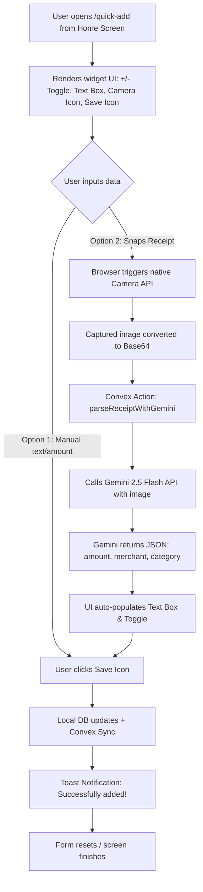

# Design Document: Quick Expense Widget & Gemini Camera Receipt Scraper

**Date:** July 21, 2026  
**Status:** ✅ **Archived — Design Complete & Implemented**  

---

## 1. PWA & Mobile Home Screen Limitations

Mobile operating systems (iOS and Android) do not currently support rendering native home-screen widgets (like Apple iOS WidgetKit or Android App Widgets) directly from a standard web app (PWA) manifest. 

### Our Solution: Standalone "/quick-add" Bookmarkable PWA Web Widget
To deliver the requested experience, we will build a dedicated, ultra-lightweight standalone page `/quick-add` that acts as a full-screen mobile widget:
1. **Home Screen Icon:** Users can save the `/quick-add` URL directly to their device's home screen (using Safari's "Add to Home Screen" or Chrome's "Add to Home Screen"). It will display a custom icon and open instantly in full-screen standalone mode.
2. **Minimalist, Widget-like UI:**
   - A large, toggleable **`+/-` Button** at the top to switch between Income (+) and Expense (-).
   - A modern input text box to type in the amount or description.
   - An integrated **Camera Icon Button** next to the input to trigger camera receipt scanning.
   - A **Save Icon Button** next to the input to instantly log the entry.
3. **Success Toast:** Once saved, a toast notification displays "Successfully added!" or the specific error message, then resets the form or closes the window.

---

## 2. Technical Architecture



### Backend: Convex Gemini Integration
1. **Convex Action (`convex/receipts.ts`):** 
   - A public action `parseReceipt` that takes a base64-encoded image.
   - Fetches the Gemini API (`https://generativelanguage.googleapis.com/v1beta/models/gemini-2.5-flash:generateContent`) passing the image data and a specific prompt:
     > *"Analyze this receipt. Return ONLY a valid JSON object matching this schema: { \"amount\": number, \"merchant\": string, \"category\": string }. Do not include markdown code block formatting."*
2. **Environment Variable:** The user sets `GEMINI_API_KEY` in the Convex dashboard. If not set, it falls back to a warning response, allowing manual input.

### Frontend: Standalone `/quick-add`
- **Route:** `src/app/quick-add/page.tsx`
- **Component:** A lightweight client page:
  - Responsive layout matching the Gen-Z styling of BudgetBITCH (vibrant dark mode, gold/amber highlights, smooth animations).
  - Native camera capture: `<input type="file" accept="image/*" capture="environment" className="hidden" />`
  - Integration with the local DB sync hooks (`useAccounts` or local database APIs) to write the transaction instantly.

---

## 3. Detailed Interface Mockup

```
   +---------------------------------------+
   |              Quick Add                |
   +---------------------------------------+
   |                                       |
   |              [  -  ]                  |  <-- Large +/- Toggle Button
   |                                       |
   |   +-------------------------------+   |
   |   | Enter amount or info...       |   |  <-- Text Box Input
   |   +-------------------------------+   |
   |                                       |
   |     [ 📷 Camera ]    [ 💾 Save ]      |  <-- Action buttons next to each other
   |                                       |
   +---------------------------------------+
```

---

## 4. Verification Plan

### Automated Tests
- Write Vitest unit tests in `src/app/quick-add/page.test.tsx` to verify:
  - Toggle swaps sign state (+ vs -).
  - Form validation behaves correctly.
  - Clicking Save writes to the database and raises the success toast.
- Write unit tests in `convex/receipts.test.ts` to mock Gemini API calls.

### Manual Verification
- Deploy to staging and open `/quick-add` on an iPhone/Android.
- Add to Home Screen and open from the home screen icon.
- Capture a dummy receipt, confirm it auto-fills the amount, and tap Save.
